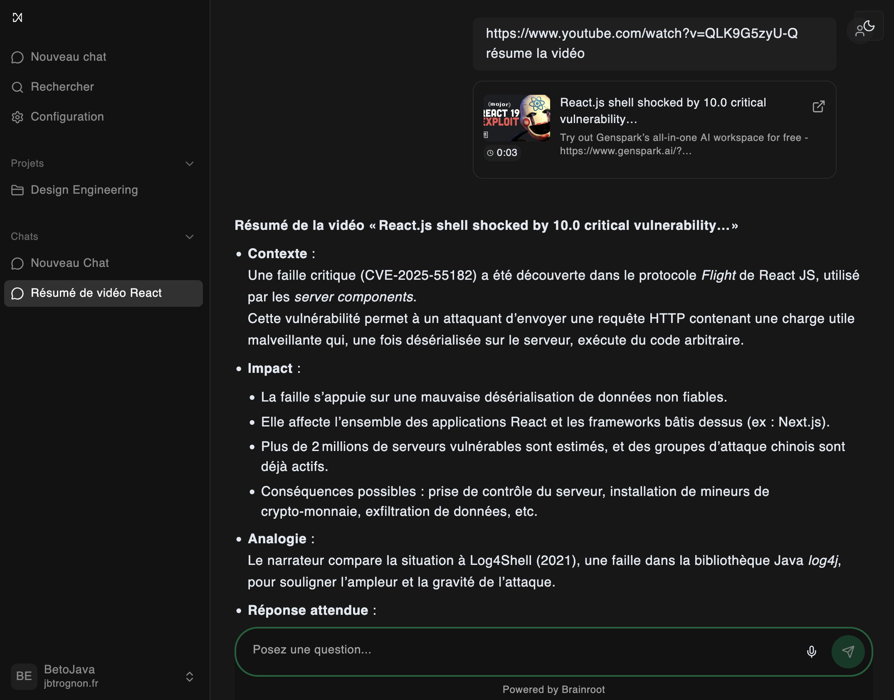

# Brainroot
Local AI chatbot interface, with Youtube integration, and other usefull interfaces.

A beet is worth a thousand words

## Installation
- create .env files for frontend and backend
- download your yt cookies from firefox
    1. `pip install yt-dlp certifi`
    2. `yt-dlp --cookies-from-browser firefox --cookies cookies.txt --skip-download "https://www.youtube.com/watch?v=dQw4w9WgXcQ"`
    3. place cookie.txt in backend
- `docker compose up`
- open http://localhost:8080

For maximum pleasure, use https://groq.com/ ultra fast models (generous free tier), instant response will make you leave chatGPT.

## Features
- basic LLM chat
- microphone transcription feature: talk to write
- youtube integration: enter your video url and chat with it (yt change often, so this feature may be broken sometimes)
- search from name and chat content

### Futur features
- model config in app (api keys, model selection)
- create folders for your chat, enhanced with system prompt and model 
- select a word on the page, and ask anything on a separate LLM chat (usefull when you are learning about a new subject with lot of jargon)
- internet toolcall and file upload
- vector DB for RAG: vectorize custom files or chats
- generate a learning sheet from a chat -> extract all learned points and synthetize the chat 